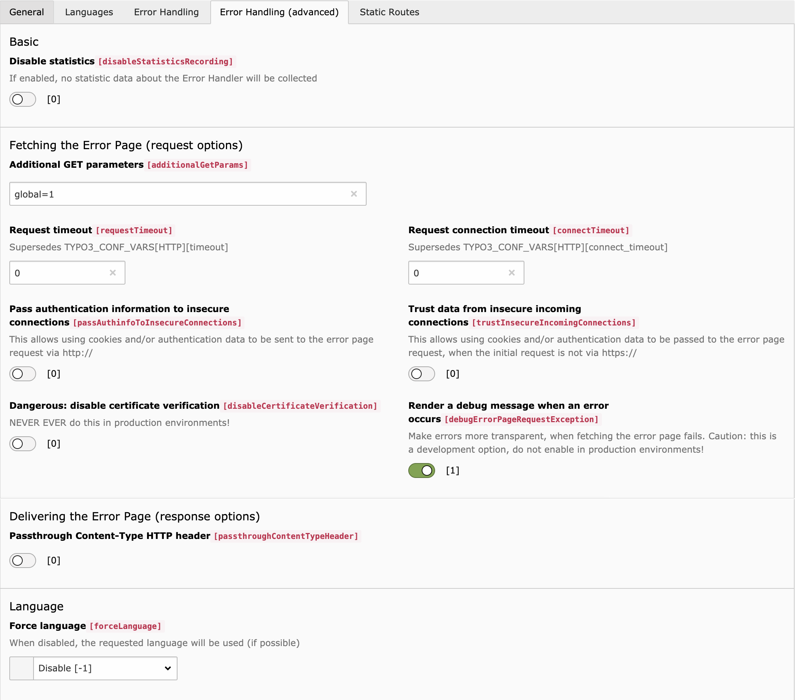

.. include:: ../../Includes.txt

.. _section-configuration-advanced:

=======================
Advanced Error Handling
=======================

The advanced Site-wide options that define the behaviour of the Error Handler.

   Advanced error handling in Site Configuration

Category: Basic
===============

disableStatisticsRecording
--------------------------

:aspect:`Datatype`
    bool

:aspect:`Description`
    If enabled, no statistic data about the Error Handler will be collected

:aspect:`Default`
    `false`

Category: Fetching the Error Page
=================================

additionalGetParams
-------------------

:aspect:`Datatype`
    string

:aspect:`Description`
    Same as `additionalGetParams` in :ref:`section-configuration-site`,
    but applies to all registered error handlers of the Site.

requestTimeout
--------------

:aspect:`Datatype`
    int

:aspect:`Description`
    Supersedes :php:`TYPO3_CONF_VARS['HTTP']['timeout']` (see
    :ref:`t3coreapi:http`). Any value below `1` is ignored.

    If :php:`TYPO3_CONF_VARS['HTTP']['timeout']` is smaller than `1`, the
    timeout will be set to `30`.

:aspect:`Default`
    `0`

connectTimeout
--------------

:aspect:`Datatype`
    int

:aspect:`Description`
    Supersedes :php:`TYPO3_CONF_VARS['HTTP']['connect_timeout']` (see
    :ref:`t3coreapi:http`). Any value below `1` is ignored.

    If :php:`TYPO3_CONF_VARS['HTTP']['connect_timeout']` is smaller than `1`,
    the connect_timeout will be set to `10`.

:aspect:`Default`
    `0`

passAuthinfoToInsecureConnections
---------------------------------

:aspect:`Datatype`
    bool

:aspect:`Description`
    This allows the usage of authentication data in the request that fetches the
    error page via unencrypted `http://`.

    This can come in handy on development systems, that do not have `https://`
    available, or in setups, where the webserver lives behind an SSL proxy.

    .. danger::
       **Never** enable this on production systems unless you really know what
       you are doing, as the authentication information will be transferred over
       an unencryped (=plaintext) connection!

:aspect:`Default`
    `false`

trustInsecureIncomingConnections
--------------------------------

:aspect:`Datatype`
    bool

:aspect:`Description`
    This allows the usage (and passing along) of authentication data, that is
    received through an unencrypred `http://` connection.

    This can come in handy on development systems, that do not have `https://`
    available, or in setups, where the webserver lives behind an SSL proxy.

    .. danger::
       **Never** enable this on production systems unless you really know what
       you are doing, as the authentication information from an unencryped
       (=plaintext) connection cannot ultimatively be trusted!

:aspect:`Default`
    `false`

disableCertificateVerification
------------------------------

:aspect:`Datatype`
    bool

:aspect:`Description`
    Disable the verification of the TLS certificate when making the connection
    to fetch the error page. 

    This can come in handy on development systems, that use self-signed
    certificates.

    .. danger::
       **Never ever** enable this on non-development systems! This option is
       **development only**.

:aspect:`Default`
    `false`

debugErrorPageRequestException
------------------------------

:aspect:`Datatype`
    bool

:aspect:`Description`
    Show debug information, when the request that should fetch the error page
    fails.

    .. caution::
       This is a debugging option, **do not enable in production environments**,
       as it will show non-public information!

:aspect:`Default`
    `false`

Category: Delivering the Error Page
===================================

passthroughContentTypeHeader
----------------------------

:aspect:`Datatype`
    bool

:aspect:`Description`
    Add the value of the HTTP header `Content-Type` from the response of the
    error page fetching request to the response that is sent back to the user.
    Thus: "passing it through".

:aspect:`Default`
    `false`

Category: Language
==================

forceLanguage
-------------

:aspect:`Datatype`
    int

:aspect:`Description`
    When composing the URI of the error page, always use the language with this
    `languageId`.

    When the Site Language cannot be found, the default language will be used.

    .. note::
       The default setting will suit almost all needs. It is likely that you
       should not use this option at all.

:aspect:`Default`
    `-1`
