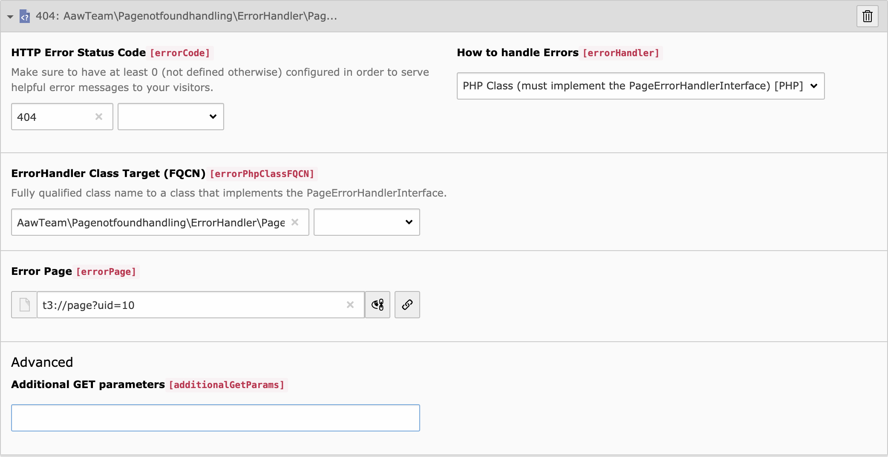

.. include:: ../../Includes.txt

.. _section-configuration-basic:

===================
Basic Configuration
===================

This is the simple "click-to-go" setup guide for the Error Handler.

To configure an error page, proceed as follows (you might be forced to reload
the screen multiple times during that process):

1. Add a new `errorHandling` section in the Site Configuration
2. Set the “HTTP Error Status Code” (`errorCode`) you wish to address
3. Choose “PHP Class” (`PHP`) in “How to handle Errors” (`errorHandler`)
4. Add this extension’s error handler in “ErrorHandler Class Target (FQCN)”
   (`errorPhpClassFQCN`). You can easily select it from the suggestion selector.

.. tip::

   You do not neccessarily have to click through this whole process, as it is
   possible to write the options down in the Site's configuration file, see
   :ref:`the official documentation <t3coreapi:sitehandling-basics>`.

   Error handling in Site Configuration
