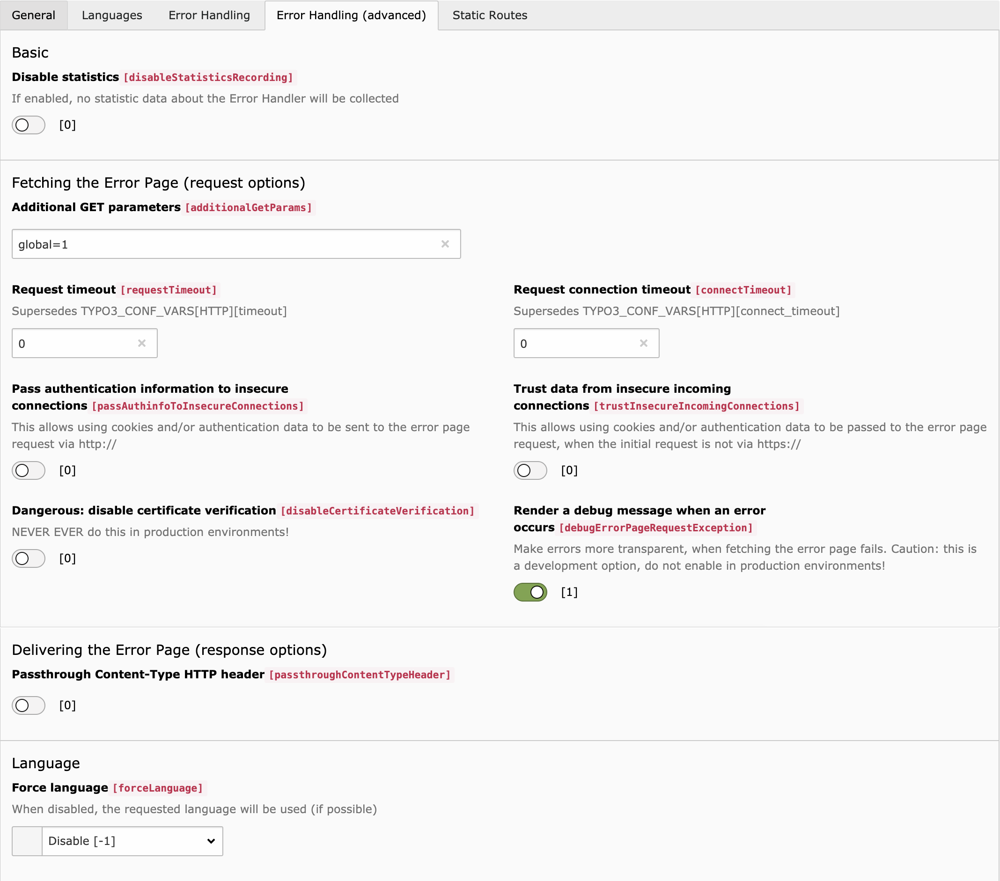

.. include:: ../Includes.txt

.. _section-introduction:

============
Introduction
============

This extension implements a versatile Error Handler for the :ref:`TYPO3 CMS Site
Handling <t3coreapi:sitehandling-errorhandling>`.

.. _section-features:

Features
========

* Seamless integration with the :ref:`TYPO3 Site Handling
  <t3coreapi:sitehandling>`
* Fetch and display any TYPO3 page in case of an error
* Configuration of the request, that fetches the URL
   * Adjust TYPO3-internal language
   * Define additional `GET` query parameters (per Site and per `errorCode`)
   * Automatically manage authentication (HTTP Basic authentication [`RFC 2617
     <https://tools.ietf.org/html/rfc2617>`_] / :ref:`TYPO3 Frontend User
     Authentication <t3coreapi:authentication>`)
   * And more, checkout the :ref:`Configuration
     reference<section-configuration>`
* Statistics
   * Data collection (can be disabled)
   * Analysis backend module (still experimental)

.. _section-screenshots:

Screenshots
===========

.. figure:: ../Images/SiteConfiguration.png
   :alt: Error handling in Site Configuration

   Error handling in Site Configuration

   Advanced error handling in Site Configuration

.. _section-credits:

Credits
=======

Thanks to the `Agentur am Wasser <https://www.agenturamwasser.ch/>`_, our
company, for giving us the possibility to realize this extension and share it
with the TYPO3 community.
